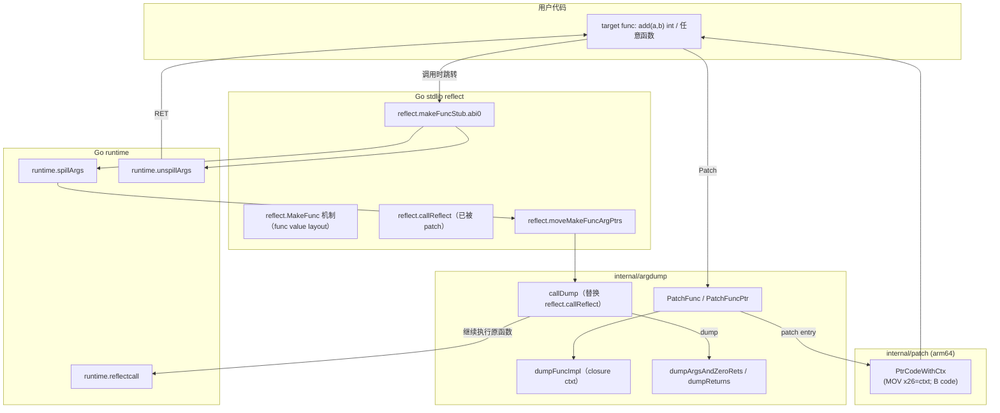

## 目标与约束

### 目标

- **Patch 任意函数**：在不改业务调用方的情况下，让目标函数每次被调用时先 dump 参数，再继续执行原函数，并可 dump 返回值。
- **不使用 `reflect.Value` 处理参数**：dump 参数/返回值时只基于 `reflect.Type` + `unsafe.Pointer` 读取内存，并调用 `abijson.EncodeJSONFromAddrWithOptions`。

### 多架构/多版本扩展

跨架构（`amd64`/`386`/`arm64`）与跨 Go 版本（`go1.13`→最新）的完整方案见：

- `internal/argdump/多架构多版本设计.md`


### 关键约束（Go1.24 + arm64/macOS）

- **Go1.24 arm64 优先寄存器传参**：必须正确处理寄存器参数/返回值。
- **`reflect.makeFuncStub` 的栈图特殊处理**：runtime 对其 stack map 有硬编码处理，必须复用 stdlib 的 stub（不要自实现一份同名 stub）。
- **arm64e/PAC 风险**：`LDR [x26] ; BR x10` 这种“从内存加载 code pointer 再间接跳转”的路径在 macOS/arm64e 上更容易触发跳转异常（历史 SIGBUS）。应尽量采用**直接分支到已知 code address**。

---

## 组件说明（模块设计图）



---

## 核心数据结构

### `dumpFuncImpl`（closure ctxt）

- 作为 func value 的 **CTXT**（arm64 为 `x26`）指向的内存。
- **前缀必须是 `makeFuncCtxt`**，以兼容 `reflect.makeFuncStub` 的读取方式。
- 额外字段：
  - `magic`: 用于在 `callDump` 中识别“这是我们自己的 closure ctxt”
  - `fnType`: `reflect.Type`（func 类型信息）
  - `abid`: ABI 描述（参数/返回值布局，寄存器/栈位置）
  - `hookGuard/origFuncVal/...`: 用于 “inspect then continue” 调用原函数并回填返回值

---

## 调用流程（PatchFunc：dump 参数 + 执行原函数 + dump 返回值）

```mermaid
sequenceDiagram
  autonumber
  participant U as 用户调用方
  participant O as 原函数入口(originPtr)
  participant P as patch.PtrCodeWithCtx
  participant S as reflect.makeFuncStub.abi0
  participant R as runtime.spillArgs / unspillArgs
  participant M as reflect.moveMakeFuncArgPtrs
  participant D as argdump.callDump
  participant C as runtime.reflectcall
  participant J as abijson.EncodeJSONFromAddrWithOptions

  Note over U,O: PatchFunc 已提前对 originPtr 写入跳转桩
  U->>O: call add(10,32)
  Note over O: 入口已被 patch：MOV x26=ctxt; B makeFuncStub
  O->>S: branch to makeFuncStub (code address)
  S->>R: spillArgs（把寄存器参数保存到 RegArgs 区域）
  S->>M: moveMakeFuncArgPtrs（修正/转移指针参数位置，用于GC/扫描）
  S->>D: callDump(ctxt, frame, &retValid, &RegArgs)

  Note over D: 识别 magic => 我们的 closure
  D->>J: dump 参数（从 frame/RegArgs 取地址）
  D->>C: reflectcall 调用原函数（使用 frame/RegArgs 重新装载寄存器参数）
  C-->>D: 返回（返回值写回 frame/RegArgs）
  D->>J: dump 返回值（从 frame/RegArgs 取地址）
  D-->>S: return
  S->>R: unspillArgs
  S-->>U: RET 回到调用方（返回值已就位）
```

---

## 关键实现细节

### 1) 为什么不能使用 `reflect.Value`

本方案的核心目标是“**直接观察真实调用现场**（寄存器 + 栈帧）里的参数/返回值”，并且尽量不引入额外副作用。`reflect.Value` 在这里不合适，主要原因：

- **会改变数据路径**：`reflect.Value` 需要把参数“装箱”为 `Value`（通常伴随把寄存器参数复制到新的内存位置、构造 slice/对象等），这会让我们观测到的变成 reflect 的中间表示，而不是“原始 frame/regs”。
- **会引入分配与逃逸**：`[]reflect.Value`、接口装箱、以及 reflect 的内部转换往往会触发堆分配/逃逸，扰动性能与 GC 行为；本工具用于 debug/trace 时希望尽量“低侵入”。

因此本方案统一采用：**`reflect.Type` 仅用于描述布局**，真实数据读取通过 **`unsafe.Pointer + ABI 描述（frame/RegArgs）`** 完成，编码通过 `abijson` 完成。


### 2) 为什么要 patch `reflect.callReflect` → `argdump.callDump`

- `reflect.makeFuncStub` 固定会 `CALL ·callReflect(SB)`。
- 标准 `callReflect` 会构造 `[]reflect.Value`，违背“不使用 reflect.Value 处理参数”的约束。
- 方案：**复用 `makeFuncStub`**（避免 runtime stack map/GC 风险），但把 `callReflect` 整体替换为 `callDump`：
  - 如果 `ctxt` 是我们自己的 closure（magic 命中），走 dump 路径
  - 否则转发到原始 `callReflect`（通过 trampoline 保存）

### 3) `reflect.MakeFunc` 为什么能在“实现函数签名不一致”时仍然接收参数

`reflect.MakeFunc` 的返回值动态类型是你指定的 `typ`（例如 `func(int,int)int`），但它的 **code 指针**统一指向 `reflect.makeFuncStub`。因此调用方会按 `typ` 的 ABI（寄存器/栈/返回区）发起调用，而 `makeFuncStub` 并不会按 Go 源码签名取参，它只做“桥接”：

- **第一段（stub/汇编层）**：把本次调用的“原始现场”整理出来
  - `runtime.spillArgs`：把寄存器承载的参数 spill 到当前栈帧里的 `abi.RegArgs` 结构（供后续读取 & 供 GC 扫描）
  - `frame`：取 `argframe` 指针（调用方为这次调用布置的栈参数/返回区）
  - 然后调用 `callReflect(ctxt, frame, &retValid, &RegArgs)`（我们用 `callDump` 替换了它）

- **第二段（Go 层 callReflect / callDump）**：用 `ctxt` 中保存的 `funcType + funcLayout(ABI)` 去“解释”这些原始字节
  - stdlib `callReflect`：把参数装箱成 `[]reflect.Value`，调用用户提供的 `fn([]Value) []Value`，再把返回值写回 `frame/RegArgs`
  - 本方案 `callDump`：从 `frame/RegArgs` 直接取每个参数/返回值的地址，调用 `abijson.EncodeJSONFromAddrWithOptions` 打印，不走 `reflect.Value`

因此，“签名不一致仍能接收参数”不是 Go 类型系统在帮忙，而是 `makeFuncStub` 把调用拆成了两段：**先捕获原始调用现场，再按目标 `funcType` 的 ABI 布局解释/回填**。

另外，runtime/GC 对 `reflect.makeFuncStub` 的栈图有特殊处理（其 `makeFuncCtxt.stack/argLen/regPtrs` 来自 `funcLayout`），这也是我们必须复用 stdlib stub 的原因。

### 4) 为什么 Patch 入口必须用 `PtrCodeWithCtx`（MOV x26 + B）

- 早期实现使用 `PtrFuncVal` 风格：`MOV x26=ctxt; LDR x10,[x26]; BR x10`
- 在 macOS/arm64e 上更容易触发 **SIGBUS/PC 跳飞**（间接 BR + 从内存加载 code pointer，可能遇到 PAC/指针认证相关问题）。
- 现在改为：
  - `MOVZ/MOVK x26=ctxtPtr`
  - `B imm26` 直接跳到**已知 code address**（`reflect.makeFuncStub.abi0`）
- 结果：稳定进入 `callDump`，消除 SIGBUS。

### 5) 寄存器传参会不会被 dump 覆盖？

- 不会。因为 `makeFuncStub` 在调用 `callDump` 前已执行：
  - `runtime.spillArgs`：把寄存器参数保存进 `abi.RegArgs`
  - `frame` 指向 stack argframe
- `callDump`/`abijson`/`fmt` 期间寄存器会被覆盖，但不影响参数正确性：
  - 我们读取参数用的是 `frame/RegArgs`
  - 调原函数用 `runtime.reflectcall`，它会从 `frame/RegArgs` 重新装载寄存器参数

### 6) 返回值 dump 与回填

- `runtime.reflectcall` 会把返回值写回 `frame/RegArgs`
- 我们在 `reflectcall` 返回后：
  - 根据 `abid.ret` 计算每个返回值的位置（栈或寄存器）
  - 栈返回：直接取 `frame + offset`
  - 寄存器返回：重建到临时 buffer 再 `EncodeJSONFromAddrWithOptions`
- 最后 `makeFuncStub` 返回到调用方时，返回值已经就位（不需要额外搬运）。

### 7) 编码策略（深度与未导出字段）

- argdump 默认将 `abijson.Options.MaxDepth = 3`，用于结构体/嵌套对象打印的深度控制。
- `abijson.encodeStruct` 已调整为**包含未导出字段**（仍不使用 `reflect.Value`，仅用 `unsafe + Offset` 读取）。

---

## 风险与边界

- **B imm26 跳转距离限制**：arm64 `B` 只能跳 ±128MB（以 4-byte 指令为单位的 26-bit 位移）。在当前 macOS 测试场景中可用；若未来遇到超范围，需要引入“加载绝对地址 + BR”的长跳，但要同时评估 arm64e/PAC 风险。
- **未导出字段打印可能涉及敏感信息**：建议后续在 Options 中增加开关以便控制（当前按需求默认打印）。
- **这是底层 patch/hook**：依赖 ABI/运行时细节，仅保证 Go1.24 + arm64 路径。


